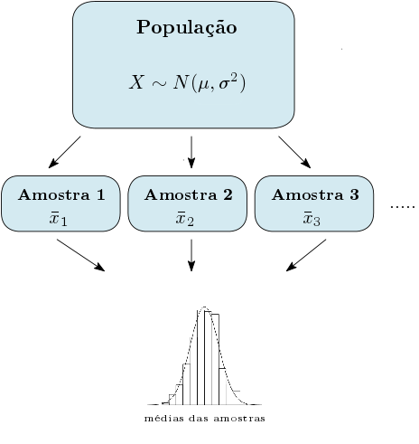

```{r setup, include=FALSE, cache=FALSE}
#source("setup_knitr.R")
knitr::opts_chunk$set(echo = TRUE,
                      comment = NA,
                      warning = FALSE,
                      message = FALSE)
```

<style>
body {
text-align: justify}
</style>

<br>
<br>
<br>


# Conceitos Básicos (29/09/2020)

<br>

- **População:** É o conjunto de todos os elementos ou resultados sob investigação, com pelo menos uma característica em comum.
- **Amostra:** É qualquer subconjunto da população.\
  *Exemplos:* 
    - P1: Todos os moradores de Curitiba.
    - P2: Todos os estudantes da UTFPR.
    - P3: Todos os celulares produzidos por uma fábrica.
    - P4: Todos os consumidores de algum produto.
                    
<br>


```{r populationvssample, echo = FALSE, fig.align = 'center', out.width = "75%", fig.cap = "**Fig 1.** Relação entre população e amostra. Fonte: Practical Statistics for Data Scientists (2017)."}

```


- **Variáveis:** São as características de interesse de uma população.\
*Exemplos:* 
- Considerando a P1, possíveis variáveis são: altura, peso, nº de filhos, renda familiar, grau de escolaridade (F, M, S), tem ensino superior (sim ou não), classe social (baixa, média, alta), sexo (masculino, feminino).
- Considerando a P3, possíveis variáveis são: peso do aparelho, nº de defeitos por aparelho, tem defeito (sim ou não), tamanho do aparelho (pequeno, médio, grande), nº de aparelhos produzidos por hora.


```{r variaveis, echo = FALSE, fig.align = 'center', out.width = "60%", fig.cap = "**Fig 2.** Classificação das variáveis."}
knitr::include_graphics("variaveis.png")
```
<br>

**Classificação das variáveis:** 

As variáveis podem assumir diferentes valores, e podem ser claassificadas em: \

- Quantitativas (numéricas)\
- Qualitativas (não numéricas, categóricas)

As variáveis \textbf{quantitativas} se classificam em:

- Discretas: assumem apenas valores inteiros.
- Contínuas: assumem qualquer valor no intervalo dos números reais. 

As variáveis \textbf{qualitativas} ou \textbf{categóricas} se classificam em:

- Ordinais: quando as categorias podem ser ordenadas. 
- Nominais: quando as categorias não possuem uma ordem natural.


| Discretas       | Contínuas      | Ordinais                       | Nominais                   |
|-----------------|----------------|--------------------------------|----------------------------|
| nº de filhos    | peso           | tamanho (P, M, G)              | sexo (M, F)                |
| nº de defeitos  | altura         | classe social (B, M, A)        | tem defeito(S, N)          |
| nº de aparelhos | renda familiar | Grau de escolaridade (F, M, S) | tem ensino superior (S, N) |

**Exercício:**  Apresentar 2 exemplos de variáveis para cada uma das classificações da Tabela acima, considerando as populações **P2** e **P4**.

<br>

- **Inferência estatística:** Conjunto de técnicas utilizadas para tirar conclusões sobre determinada(s) característica(s) da população, a partir de informações colhidas de uma amostra.
- **Amostra Aleatória (a.a.):**	Uma a.a. de tamanho $n$ de uma população $X$, com dada distribuição, é o conjunto de $n$ variáveis aleatórias independentes $X_{1}, X_{2}, ....,X_{n}$, cada uma com a mesma distribuição de X.

```{r inf5, echo = FALSE, fig.align = 'center', out.width = "40%"}

```

<br>

- **Parâmetros:** 	São medidas utilizadas para descrever características da população.
- **Estatísticas:** 	São características da amostra, ou seja, uma estatística T é uma função de $X_{1}, X_{2}, ....,X_{n}$.

```{r pars_normal, echo = FALSE, fig.align = 'center', out.width = "40%", fig.cap = "**Fig 3.**Representação de parâmetros e estatísticas - distribuição Normal."}
knitr::include_graphics("par_normal.png")
```
<br>

```{r pars_bern, echo = FALSE, fig.align = 'center', out.width = "40%", fig.cap = "**Fig 4.**Representação de parâmetros e estatísticas - distribuição Bernoulli"}

```
<br>

**Exemplos de parâmetros:** média populacional, variância populacional, desvio-padrão populacional, proporção populacional;

**Exemplos de estatísticas:** média amostral, variância amostral, desvio-padrão amostral, proporção amostral.

<br>

| Medidas |	Parâmetros | Estatísticas   |
|-----------------|----------------|-------------------------|
|Média | $\mu = \dfrac{X_1+X_2+...+X_N}{N}$  | $\bar{X} = \dfrac{X_1+X_2+...+X_n}{n}$ |
|Variância | $\sigma^2=\sum_{i=1}^{N}\dfrac{(X_i-\mu)^2}{N}$ | $S^2 = \sum_{i=1}^{n}\dfrac{(X_i-\bar{X})^2}{n-1}$ ou $\hat{\sigma}^2 = \sum_{i=1}^{n}\dfrac{(X_i-\bar{X})^2}{n}$ |
|Desvio-padrão | $\sigma = \sqrt{\sigma^2}$ | $S = \sqrt{(S^2)}$ |
|Proporção | $p = \dfrac{X_1+X_2+...+X_N}{N}$ | $\hat{X} = \dfrac{X_1+X_2+...+X_n}{n}$ |

```{R 1.1}

### Exemplo 1 no R: Parâmetros e Estatísticas

## Simulando uma população com distribuição normal com média 170 cm e desvio-padrão 20 cm.

rm(list = ls())
set.seed(123456)
sig <- 20
mi <- 170
n_val <- 10000

alt <- rnorm(n_val, mean =  170, sd = 20)

calc_media_var_pop <- function(x)
{
  m <- mean(x)
  s <- sqrt(sum((x-m)^2)/length(x))
  return(list(media = m, var = s))
}

calc_media_var_pop(alt)

## Gerando valores aleatórios da normal com média e variância exatas

# var_n_menos_1 = (n*var_n/(n-1))
# sd_n_menos_1 = sqrt(n*var_n/(n-1))
# x_exata = scale(rnorm(n = n_val))*sd_n_menos_1 + mi

sd_n_menos_1 <- sqrt((sig^2)*n_val/(n_val-1))
alt_ex <- scale(rnorm(n_val, mean =  170, sd = 20))*sd_n_menos_1  + mi

calc_media_var_pop(alt_ex)

# rnorm gera números aleatórios da distribuição Normal
# dnorm calcula a função densidade de probabilidade da distribuição Normal
# pnorm calcula a função de distribuição acumulada da distribuição Normal
# qnorm encontra os quantis da distribuição Normal


## Histograma das alturas

hist(alt_ex, probability = T, xlim = c(min(alt_ex), max(alt_ex)), ylab = "", xlab = "Alturas")
curve(dnorm(x, mean = 170, sd = 20), from = 90, to = 250, add = T,
      fg = "white", col.axis = "white",ylab = "", xlab = "")

## Parâmetros

mi_alt <- mean(alt_ex) # Média populacional
var_alt <- (sum((alt_ex-mi_alt)^2))/length(alt_ex) ## variância populacional
desvio_alt <- sqrt(var_alt) ## desvio-padrão populacional
mi_alt
desvio_alt

## Selecionando amostras da população

amostra1 <- sample(alt_ex, size = 10, replace = T)

## Estatísticas

m1<- mean(amostra1)
s1 <- sd(amostra1)

## Aumentando o tamanho das amostras

amostra2 <- sample(alt_ex, size = 50, replace = T)
m2 <- mean(amostra2)
s2 <- sd(amostra2)

amostra3 <- sample(alt_ex, size = 100, replace = T)
m3 <- mean(amostra3)
s3 <- sd(amostra3)

amostra4 <- sample(alt_ex, size = 500, replace = T)
m4 <- mean(amostra4)
s4 <- sd(amostra4)

amostra5 <- sample(alt_ex, size = 1000, replace = T)
m5 <- mean(amostra5)
s5 <- sd(amostra5)

amostra6 <- sample(alt_ex, size = 2000, replace = T)
m6 <- mean(amostra6)
s6 <- sd(amostra6)

amostra7 <- sample(alt_ex, size = 5000, replace = T)
m7 <- mean(amostra7)
s7 <- sd(amostra7)

m <- c(m1, m2, m3, m4, m5, m6, m7)
s <- c(s1, s2, s3, s4, s5, s6, s7)

par(mfrow = c(1,2))
plot(m)
abline(h=170)
plot(s)
abline(h=20)
``` 
<br>

**Exercícios no R:** \
1 - Simular 5000 pesos de uma população com distribuição Normal com parâmetros $\mu=90$ e $\sigma^2=9$;\
2- Construir um histograma para esta variável, considerando as densidades de frequência, e adicionar a curva teórica da Normal;\
3- Selecionar uma amostra, com reposição de tamanho $n = 100$ desta população;\
4 - Calcular as estatísticas: média, variância e desvio-padrão da amostra.

<br>

**Estimador:** São estatísticas utilizadas para estimar os parâmetros. Aos valores observados dos estimadores dá-se o nome de \textbf{estimativas}.
	
|	Parâmetros | Estimadores  | Propriedades |
|-----------------|----------------|-------------------------|
|	$\mu$  | $\bar{X} = \dfrac{X_1+X_2+...+X_n}{n}$ | Não viciado e consistente | 
| $\sigma^2$ | $S^2 = \sum_{i=1}^{n}\dfrac{(X_i-\bar{X})^2}{n-1}$ | Não viciado e consistente |
|		$p$ | $\hat{X} = \dfrac{X_1+X_2+...+X_n}{n}$| Não viciado e consistente|
		
<br>

**Distribuição amostral de um Estimador:** É o comportamento probabilístico do estimador, isto é, sua distribuição de probabilidade, caso todas as possíveis amostras fossem retiradas.
		
```{r dist5, echo = FALSE, fig.align = 'center', out.width = "50%", fig.cap = "**Fig 5.** Distribuição amostral das médias"}

```

<br>		
		
```{R 1.4, echo = TRUE}
### Exemplo 2: Distribuição amostral da média - População Normal

##  População

# Variável = alt_ex
# media = mi_alt = 170
# sd = desvio_alt = 20

n_5 <- 5
n_50 <- 50
n_200 <- 200

amostra5 = matrix(0, ncol = 1000, nrow = n_5)
amostra50 = matrix(0, ncol = 1000, nrow = n_50)
amostra200 = matrix(0, ncol = 1000, nrow = n_200)

media5 <- media50 <- media200 <- 0

for(j in 1:1000)
{
  amostra5[,j] = sample(alt_ex, size = n_5, replace = T)
  media5[j] = mean(amostra5[,j])
  amostra50[,j] = sample(alt_ex, size = n_50, replace = T)
  media50[j] = mean(amostra50[,j])
  amostra200[,j] = sample(alt_ex, size = n_200, replace = T)
  media200[j] = mean(amostra200[,j])
}


## Histogramas lado a lado

par(mfrow = c(1,3))
hist(media5, xlim =  c(min(media5), max(media5)), main = "n=5", 
     xlab = 'Médias das amostras', freq = F, col = rgb(1,0,0,0.3), ylim = c(0, 0.05))
curve(dnorm(x, mean = mi_alt, sd = desvio_alt/sqrt(n_5)), add = T, 
      lwd = 2, col = "red")

hist(media50, freq  = F, col = rgb(0,0,1,0.3), ylim = c(0, 0.14),
     main = "n=50", xlab = 'Médias das amostras')
curve(dnorm(x, mean = mi_alt, sd = desvio_alt/sqrt(n_50)), add = T, 
      lwd = 2, col = "blue")

hist(media200, freq  = F, col = rgb(0,1,0,0.3), ylim = c(0, 0.26),
     main = "n=200", xlab = 'Médias das amostras')
curve(dnorm(x, mean = mi_alt, sd = desvio_alt/sqrt(n_200)), add = T, 
      lwd = 2, col = "green")


## Histogramas sobrepostos

par(mfrow = c(1,1))
hist(media5, xlim =  c(min(media5), max(media5)), ylim = c(0, 0.26),
     xlab = 'Médias das amostras', main = "", freq = F, col = rgb(1,0,0,0.3))
curve(dnorm(x, mean = mi_alt, sd = desvio_alt/sqrt(n_5)), add = T,
      lwd = 2, col = "red")

hist(media50, freq  = F, add = T, col = rgb(0,0,1,0.3))
curve(dnorm(x, mean = mi_alt, sd = desvio_alt/sqrt(n_50)), add = T, 
      lwd = 2, col = "blue")

hist(media200, freq  = F, add = T, col = rgb(0,1,0,0.3))
curve(dnorm(x, mean = mi_alt, sd = desvio_alt/sqrt(n_200)), add = T, 
      lwd = 2, col = "green")

# legenda

legend("topright", legend=c("n = 5","n = 50", "n = 200"), 
       col=c(rgb(1,0,0,0.3), rgb(0,0,1,0.3), rgb(0,1,0,0.3)), pt.cex=2, pch=15)
``` 

<br>

- **Distribuição amostral da média: População Normal**

```{r dist_med, echo = FALSE, fig.align = 'center', out.width = "50%", fig.cap = "**Fig 6.** Distribuição amostral das médias - População Normal"}
knitr::include_graphics("dist_med_norm.png")
```

<br>

```{R 1.5, echo = TRUE}

### Exemplo 3: Distribuição amostral da média - População não Normal

rm(list = ls())
n_pop <- 10000
lamb <- 5

n_5 <- 5
n_50 <- 50
n_200 <- 200

set.seed(12345)
x_pois <- rpois(n = n_pop, lambda = lamb)
med_pois <- mean(x_pois)
sd_pois <- sd(x_pois)

amostra5 = matrix(0, ncol = 1000, nrow = n_5)
amostra50 = matrix(0, ncol = 1000, nrow = n_50)
amostra200 = matrix(0, ncol = 1000, nrow = n_200)

media5 <- media50 <- media200 <- 0

for(j in 1:1000)
{
  amostra5[,j] = sample(x_pois, size = n_5, replace = T)
  media5[j] = mean(amostra5[,j])
  amostra50[,j] = sample(x_pois, size = n_50, replace = T)
  media50[j] = mean(amostra50[,j])
  amostra200[,j] = sample(x_pois, size = n_200, replace = T)
  media200[j] = mean(amostra200[,j])
}


## Histogramas lado a lado

par(mfrow = c(1,3))
hist(media5, xlim =  c(min(media5), max(media5)), ylim = c(0, 0.5), 
     xlab = 'Médias das amostras', main = "n=5", freq  = F, col = rgb(1,0,0,0.3))
curve(dnorm(x, mean = med_pois, sd = sd_pois/sqrt(n_5)), add = T, 
      lwd = 2, col = "red")

hist(media50, freq  = F, xlim = c(min(media50), max(media50)), 
     xlab = 'Médias das amostras', main = "n=50", ylim = c(0, 1.3), col = rgb(0,0,1,0.3))
curve(dnorm(x, mean = med_pois, sd = sd_pois/sqrt(n_50)), add = T,
      lwd = 2, col = "blue")

hist(media200, freq  = F, xlim = c(min(media200), max(media200)), 
     xlab = 'Médias das amostras', main = "n=200", ylim = c(0, 2.5), col = rgb(0,1,0,0.3))
curve(dnorm(x, mean = med_pois, sd = sd_pois/sqrt(n_200)), add = T, 
      lwd = 2, col = "green")


## Histogramas sobrepostos

par(mfrow = c(1,1))
hist(media5, xlim =  c(min(media5), max(media5)), ylim = c(0,2.5), 
     xlab = 'Médias das amostras', main = "", freq  = F, col = rgb(1,0,0,0.3))
curve(dnorm(x, mean = med_pois, sd = sd_pois/sqrt(n_5)), add = T, 
      lwd = 2, col = "red")
hist(media50, freq  = F, add = T, col = rgb(0,0,1,0.3))
curve(dnorm(x, mean = med_pois, sd = sd_pois/sqrt(n_50)), add = T, 
      lwd = 2, col = "blue")
hist(media200, freq  = F, add = T, col = rgb(0,1,0,0.3))
curve(dnorm(x, mean = med_pois, sd = sd_pois/sqrt(n_200)), add = T, 
      lwd = 2, col = "green")

# legenda
legend("topright", legend=c("n = 50","n = 100", "n = 200"), col=c(rgb(1,0,0,0.3), rgb(0,0,1,0.3), rgb(0,1,0,0.3)), pt.cex=2, pch=15 )
```

<br>

- **Distribuição amostral da média: População não Normal**

```{r dist_med_nnormal, echo = FALSE, fig.align = 'center', out.width = "50%", fig.cap = "**Fig 7.** Distribuição amostral das médias - População não Normal"}

```

<br>

```{R 1.6, echo = TRUE}
### Exemplo 4: Distribuição amostral da proporção

rm(list = ls())
n_pop <- 10000
n_5 <- 5
n_50 <- 50
n_200 <- 200

set.seed(12345)
x_bern = rbinom(n_pop, 1, 0.3) # p = 0.3
med_bern <- mean(x_bern)
sd_bern <- sd(x_bern)

amostra5 = matrix(0, ncol = 1000, nrow = n_5)
amostra50 = matrix(0, ncol = 1000, nrow = n_50)
amostra200 = matrix(0, ncol = 1000, nrow = n_200)

pchap5 <- pchap50 <- pchap200 <- 0

for(j in 1:1000)
{
  amostra5[,j] = sample(x_bern, size = n_5, replace = T)
  pchap5[j] = mean(amostra5[,j])
  amostra50[,j] = sample(x_bern, size = n_50, replace = T)
  pchap50[j] = mean(amostra50[,j])
  amostra200[,j] = sample(x_bern, size = n_200, replace = T)
  pchap200[j] = mean(amostra200[,j])
}


## Histogramas lado a lado

par(mfrow = c(1,3))
hist(pchap5, xlim =  c(min(pchap5), max(pchap5)), ylim = c(0, 4), 
     xlab = 'Proporções das amostras', main = "n=5", freq  = F, col = rgb(1,0,0,0.3))
curve(dnorm(x, mean = med_bern, sd = sd_bern/sqrt(n_5)), add = T, 
      lwd = 2, col = "red")

hist(pchap50, freq  = F, xlim = c(min(pchap50), max(pchap50)), 
     xlab = 'Proporções das amostras', main = "n=50", ylim = c(0, 7.5), col = rgb(0,0,1,0.3))
curve(dnorm(x, mean = med_bern, sd = sd_bern/sqrt(n_50)), add = T,
      lwd = 2, col = "blue")

hist(pchap200, freq  = F, xlim = c(min(pchap200), max(pchap200)), 
     xlab = 'Proporções das amostras', main = "n=200", ylim = c(0, 13), col = rgb(0,1,0,0.3))
curve(dnorm(x, mean = med_bern, sd = sd_bern/sqrt(n_200)), add = T, 
      lwd = 2, col = "green")


## Histogramas sobrepostos

par(mfrow = c(1,1))
hist(pchap5, xlim =  c(min(pchap5), max(pchap5)), ylim = c(0, 13), 
     xlab = 'Proporções das amostras', main = "", freq  = F, col = rgb(1,0,0,0.3))
curve(dnorm(x, mean = med_bern, sd = sd_bern/sqrt(n_5)), add = T, 
      lwd = 2, col = "red")
hist(pchap50, freq  = F, add = T, col = rgb(0,0,1,0.3))
curve(dnorm(x, mean = med_bern, sd = sd_bern/sqrt(n_50)), add = T, 
      lwd = 2, col = "blue")
hist(pchap200, freq  = F, add = T, col = rgb(0,1,0,0.3))
curve(dnorm(x, mean = med_bern, sd = sd_bern/sqrt(n_200)), add = T, 
      lwd = 2, col = "green")

# legenda
legend("topright", legend=c("n = 50","n = 100", "n = 200"), col=c(rgb(1,0,0,0.3), rgb(0,0,1,0.3), rgb(0,1,0,0.3)), pt.cex=2, pch=15 )

```

<br>

- **Distribuição amostral da proporção**

```{r dist_prop, echo = FALSE, fig.align = 'center', out.width = "50%", fig.cap = "**Fig 8.** Distribuição amostral das médias - População não Normal"}
knitr::include_graphics("dist_prop.png")
```

<br>

**Exemplo 5 no R:** Os salários de funcionários de uma empresa seguem distribuição Normal, com média 1500 e desvio padrão 250. Calcule a probabilidade de que os salários médios das amostras de tamanhos 10 estejam entre 1400 e 1600.
	
<br>

```{r dist_med_ex1, echo = FALSE, fig.align = 'center', out.width = "30%"}
knitr::include_graphics("dist_med_ex1.png")
```

<br>

```{R 1.7, echo = TRUE}
### Exemplo 5: Calculando probabilidades para as médias das amostras

pnorm(1600, mean = 1500, sd = 250/sqrt(10)) - pnorm(1400, mean = 1500, sd = 250/sqrt(10))

## Plotando a região

mx <- 1500
sdx <- 250/sqrt(10)
x <- seq(1000, 2000,length=1000)
fx <- dnorm(x, mean = mx, sd = sdx)

plot(x, fx, type = "n", xlab="médias das amostras", ylab="",
     main="", axes = T)

li <- 1400; ls <- 1600
i <- x >= li & x <= ls
lines(x, fx)
polygon(c(li, x[i], ls), c(0, fx[i], 0), col=rgb(1,0,0,0.3))
```

<br>

**Exemplo 6 no R:** Suponha que estamos interessados em estimar a proporção de consumidores de certo produto. Considerando a seleção de uma amostra aleatória de 300 pessoas, calcule a	probabilidade de que a proporção amostral de consumidores seja de, no mínimo, 35\%, sabendo que a verdadeira proporção é de 40\%.

<br>

```{r dist_med_ex2, echo = FALSE, fig.align = 'center', out.width = "30%"}
knitr::include_graphics("dist_med_ex2.png")
```

<br>

```{R 1.8, echo = TRUE}
### Exemplo 6: Calculando probabilidades para as proporções das amostras

1 - pnorm(0.35, mean = 0.4, sd = sqrt(0.4*(1-0.4)/300)) 

# ou

pnorm(0.35, mean = 0.4, sd = sqrt(0.4*(1-0.4)/300), lower.tail = F) 

## Plotando a região

mp <- 0.4
sdp <- sqrt(0.4*(1-0.4)/300)
p <- seq(0.2, 0.6,length=1000)
fp <- dnorm(p, mean = mp, sd = sdp)

plot(p, fp, type = "n", xlab="proporções das amostras", ylab="",
     main="Normal Distribution", axes = T)

li <- 0.35; ls <- 0.8
i <- p >= li & p <= ls
lines(p, fp)
polygon(c(li, p[i], ls), c(0, fp[i], 0), col=rgb(0,1,0,0.3))
```

<br>

**Exercícios no R:**\
1 - Admite-se que as alturas dos estudantes de uma universidade seguem distribuição Normal com média 172.72 cm e desvio padrão 7.62 cm. Calcule a probabilidade de que a altura média amostral se encontre entre 169.67 cm e 173.48 cm, considerando amostras aleatórias de 25 estudantes. **R: 0.6683**.\
2 - Suponha que 60\% da população de uma certa cidade seja a favor da criação de um fundo público para fins de criação de áreas de lazer. Se 150 pessoas forem selecionadas aleatoriamente e entrevistadas, qual a probabilidade de que a proporção amostral de pessoas favoráveis seja menor que 0.52? **R:0.0227**


<br>
<br>

# Estimação por intervalo (06/10/2020)

<br>
<br>

**Tipos de estimação:**\
- Estimação pontual\
- Estimação por intervalo

<br>

```{r aula21, echo = FALSE, fig.align = 'center', out.width = "10%"}

```

<br>

**Exemplo 7 no R:**\
1- Uma empresa deseja estudar seus layouts na Web. Assim, coletaram quanto tempo as pessoas passam em cada uma das página A ou B. Construir um intervalo para o tempo médio de permanencia na página A, com 95\% e 99\% de confiança, sabendo que os tempos médios de permanência na página A seguem distribuição Normal com desvio-padrão 1.\
2 - No item anterior, qual o tamanho de amostra necessário para se obter um erro de 0.17 com 99\% de confiança?


<br>
```{R ex7}
### Exemplo 7 no R: web_data.csv - variância conhecida

## Lendo os dados:

rm(list = ls())
web_data <- read.csv("https://felipebarletta.github.io/DAEST/web_data.csv", header = T, sep = ',')
attach(web_data) ## facilita o chamamento das variáveis

plot(time~page)

page_A <- subset(web_data, subset = page=='A') 
page_B <- subset(web_data, subset = page=='B') 

## Medidas Amostrais

(medA <- mean(page_A$time))
(nA <- length(page_A$time))
(tapply(web_data$time, web_data$page, summary))
sd(page_A$time)


## Medidas Populacionais

sigA <- 1 ## desvio-padrão populacional 

## Intervalo de confiança para o tempo médio na pag A - var conhecida
## Considerando 95% de confiança

conf <- 0.95
alpha = 1 - conf
(z <- qnorm(1-alpha/2))
(e <- z*sigA/sqrt(nA))
(IC_mi_PageA <- c(medA-e, medA+e))

## Temos 95% de confiança de que o verdadeiro tempo médio de permanência na página A está entre: 1.606219 e 2.160581.
 

## Considerando 99% de confiança

conf <- 0.99
alpha = 1 - conf
(z <- qnorm(1-alpha/2))
(e <- z*sigA/sqrt(nA))

(IC_mi_PageA <- c(medA-e, medA+e))

## Temos 99% de confiança de que o verdadeiro tempo médio de permanência na página A está entre: 1.519123 e 2.247677.

## Tamanho amostral

e <- 0.17; sigA <- 1; alpha <- 0.01
round(n <- (qnorm(1-alpha/2)*sigA/e)^2)
``` 

<br>
<br>

```{R ex8}
### Exemplos 8 no R: loans_income.csv - variância desconhecida

## Lendo os dados:

rm(list = ls())
income_data <- read.csv("https://felipebarletta.github.io/DAEST/income800.csv", header = T, sep = ',')
attach(income_data) ## facilita o chamamento das variáveis

## observação, os dados não tem distribuição Normal, mas pelo TLC a aproximação para as médias pode ser usada

hist(x)
summary(x)

## Intervalo de confiança para o tempo médio de vida - var desconhecida

## Considerando 95% de confiança

sig_inc <- sd(income_data$x) ## desvio-padrão amostral
med_inc <- mean(x) ## média amostral
(n_inc <- length(x))
conf <- 0.95
alpha = 1 - conf
(t <- qt(1-alpha/2, df = n_inc-1))
(e <- t*sig_inc/sqrt(n_inc))

(IC_mi_inc <- c(med_inc-e, med_inc+e))

## ou

#install.packages("gmodels")
library("gmodels")

ci(x) ## var desconhecida - estat t-student
```

<br>
<br>

```{R ex9}
### Exemplos 9 no R: Vendas - IC variancia

rm(list = ls())
vendas <- c(275,258,242,229,225,134,227,249,259,191)

## ou 
## vendas <- scan()  ## se copiar os dados de outro lugar e colar no R
```

```{R ex9.1}
n <- length(vendas)
s <- sd(vendas)
conf <- 0.90
alpha = 1-conf

## observação
## qnorm -> quantil da distribuição Normal
## qt -> quantil da distribuição t
## qchisq -> quantil da distribuição qui-quadrado

chisq1 = qchisq(alpha/2, df = n-1)
chisq2 = qchisq(alpha/2, df = n-1, lower.tail = F)

(IC_sig = c((n-1)*(s^2)/chisq2, (n-1)*(s^2)/chisq1))
```

<br>
<br>

```{R ex10}
### Exemplos 10 no R: Melanoma - IC proporção

rm(list = ls())
library("MASS")
#data(package = "MASS") ## conjuntos de dados do pacote
# data()  ## conjuntos de dados do R

data("Melanoma")
?Melanoma  ## descrição dos dados
unique(Melanoma$sex)
table(Melanoma$sex)

n_mel <- nrow(Melanoma)
(p_chap <- sum(Melanoma$sex == 0)/n_mel)
conf <- 0.90
alpha = 1-conf
e <- qnorm(1-alpha/2)*sqrt(p_chap*(1-p_chap)/n_mel)
(IC_prop <- c(p_chap-e, p_chap+e))

## Temos 90% de confiança de que a verdadeira proporção de mulheres com melanoma na população está entre 55,87% e 67,05%
``` 
